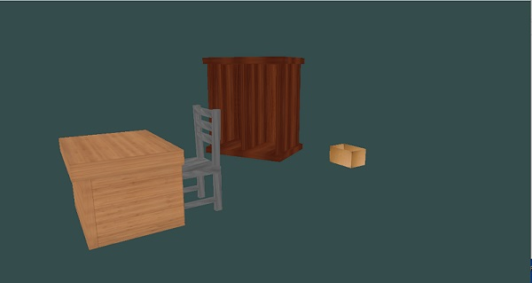

# opengl-objects-transformation

### Objects:
- table
- wardrobe
- chair
- cardboard box
- book

### Controls:

ESC = exit  
Spasi = menu (change background color and object selection)  
 
W, A, S, D = camera  
mouse = camera  
 
Arrow = translate object  
Q + arrow = rotate object  
Z = Enlarge objek  
X = shrink objek  